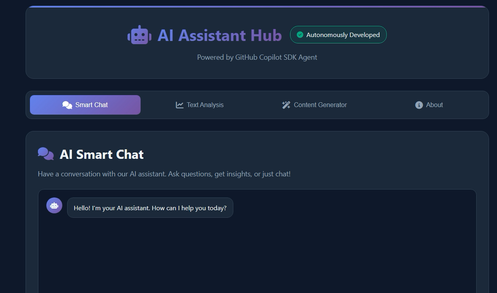
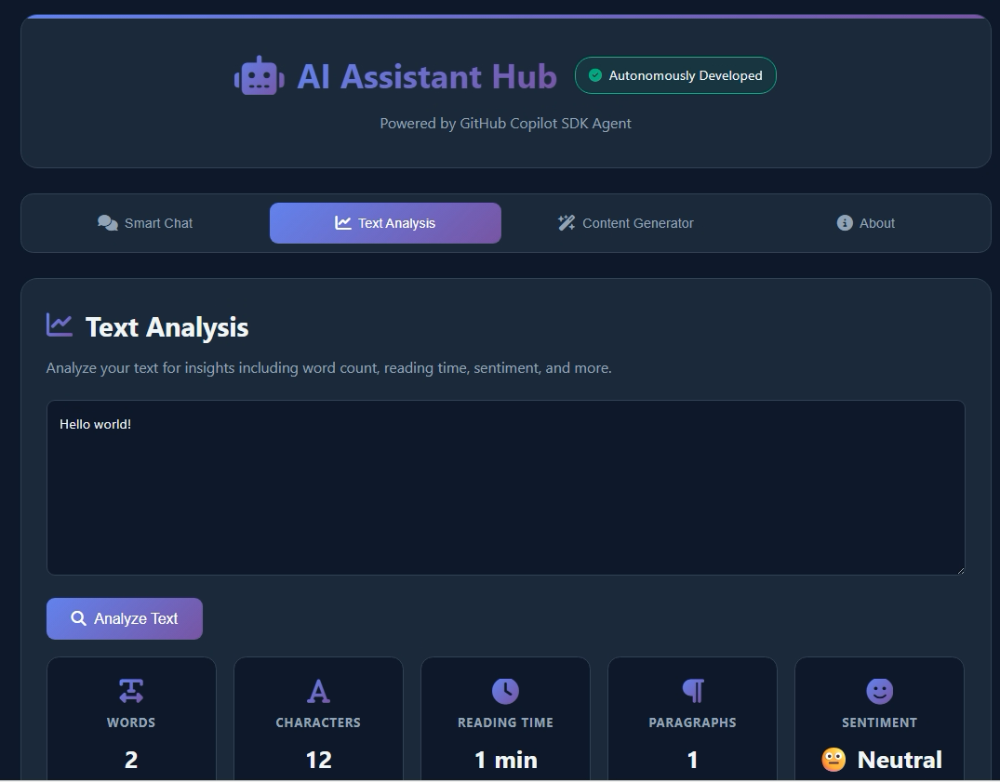
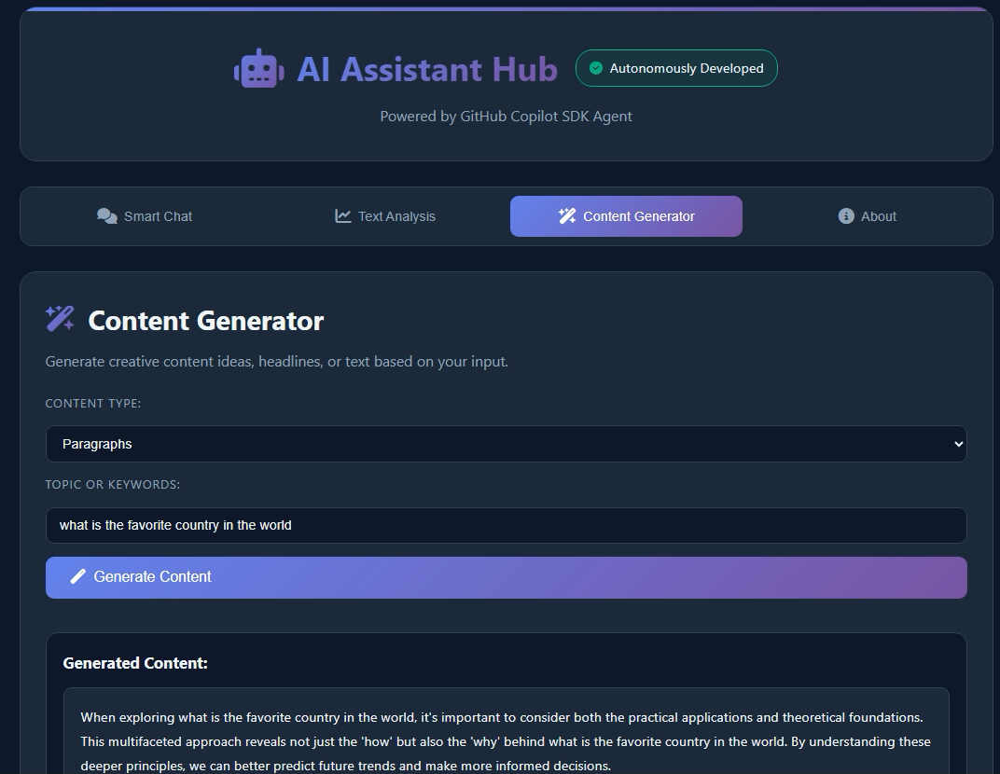
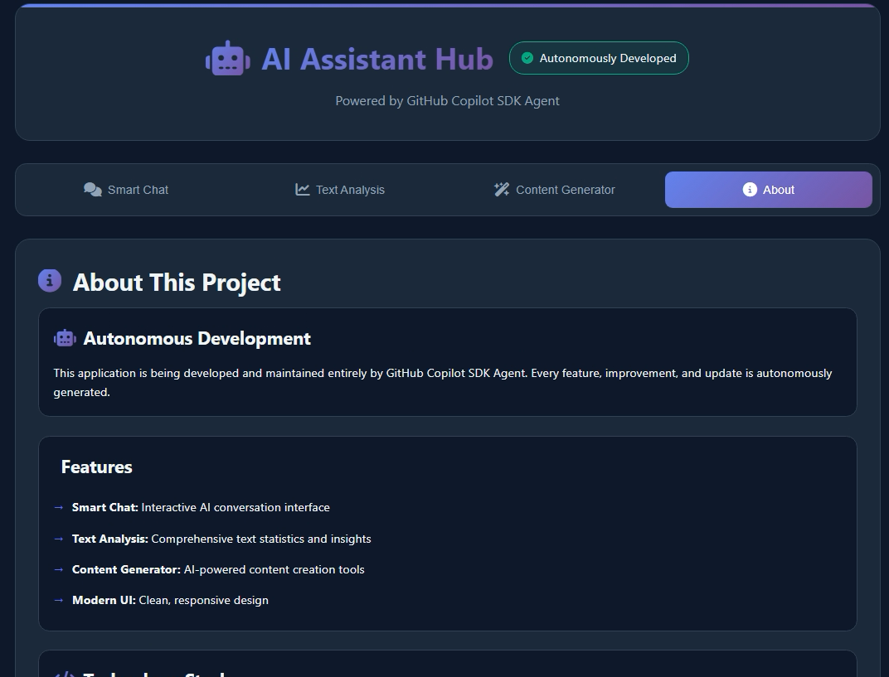

# 🤖 AI Assistant Hub - Fully Autonomous Development

> **⚡ This repository is entirely developed and maintained by GitHub Copilot SDK Agent**  
> Every line of code, feature, and improvement is autonomously generated through AI-powered development.


---

## 📸 Application Screenshots

### Smart Chat Interface

*Interactive AI conversation with context-aware responses and beautiful message design*

### Text Analysis Tool

*Comprehensive text statistics including word count, sentiment analysis, and complexity scoring*

### Content Generator

*AI-powered content creation for headlines, paragraphs, ideas, and summaries*

### About Page

*Detailed information about the autonomous development process and technology stack*

---

## 🌟 About This Project

**AI Assistant Hub** is a showcase of autonomous software development, where GitHub Copilot SDK Agent independently designs, codes, and maintains a fully functional web application. This project demonstrates the cutting-edge capabilities of AI-driven development workflows.

### 🎯 Key Features

#### 💬 Smart Chat Interface
- Interactive AI conversation system
- Context-aware responses
- Real-time message exchange
- Intelligent keyword recognition
- Smooth animations and transitions

#### 📊 Text Analysis Tool
- **Word Count**: Precise word counting
- **Character Count**: Total character analysis
- **Reading Time**: Estimated reading duration
- **Paragraph Count**: Document structure analysis
- **Sentiment Analysis**: Emotional tone detection (Positive/Neutral/Negative)
- **Complexity Score**: Text difficulty assessment

#### ✨ Content Generator
- **Headlines**: Generate compelling titles
- **Paragraphs**: Create full paragraphs on any topic
- **Ideas**: Brainstorm creative concepts
- **Summaries**: Quick executive summaries
- Copy-to-clipboard functionality
- Customizable output types

---

## 🚀 Quick Start

### Option 1: Direct Browser Access
1. Download or clone this repository
2. Open `index.html` in any modern web browser
3. Start exploring the AI features!

### Option 2: Local Server
```bash
# Using Python
python -m http.server 8000

# Using Node.js
npx http-server

# Using PHP
php -S localhost:8000
```

Then navigate to `http://localhost:8000` in your browser.

---

## 🛠️ Technology Stack

- **HTML5**: Semantic markup and structure
- **CSS3**: Modern styling with CSS Grid, Flexbox, and animations
- **Vanilla JavaScript**: No frameworks, pure ES6+ code
- **Font Awesome 6**: Professional icon library
- **Responsive Design**: Mobile-first approach

### Design Highlights
- Dark theme optimized for extended use
- Gradient accents for visual appeal
- Smooth animations and transitions
- Accessible and user-friendly interface
- Fully responsive across all devices

---

## 📋 Features Breakdown

### Chat Interface
The Smart Chat feature provides an interactive experience where users can:
- Ask questions about AI and technology
- Get instant, context-aware responses
- Experience natural conversation flow
- View beautifully formatted message threads

### Text Analysis
Comprehensive text analysis tool that provides:
- Instant statistical analysis
- Sentiment detection using keyword matching
- Reading time estimation (200 words/min average)
- Complexity assessment based on word length
- Visual presentation of results

### Content Generator
AI-powered content creation that helps with:
- Generating attention-grabbing headlines
- Creating engaging paragraphs
- Brainstorming creative ideas
- Writing quick summaries
- All with customizable topics

---

## 🎨 Design Philosophy

This application follows modern web design principles:
- **Minimalist**: Clean, uncluttered interface
- **Intuitive**: Self-explanatory navigation
- **Performant**: Optimized for speed
- **Accessible**: Works on all devices and screen sizes
- **Engaging**: Smooth interactions and visual feedback

---

## 🤖 Autonomous Development Process

This project showcases AI capabilities in:
1. **Architecture Design**: Structured, modular codebase
2. **UI/UX Design**: Modern, user-friendly interface
3. **Feature Implementation**: Complete, working functionality
4. **Code Quality**: Clean, documented, maintainable code
5. **Responsive Design**: Mobile-first, cross-device compatibility

---

## 📊 Project Statistics

- **Files**: 4 (HTML, CSS, JavaScript, README)
- **Lines of Code**: ~1,500+
- **Features**: 3 major AI-powered tools
- **Dependencies**: Font Awesome (CDN)
- **Browser Support**: All modern browsers
- **Development Time**: Autonomous (continuous)

---

## 🔮 Roadmap

Future enhancements (to be autonomously developed):
- [ ] Integration with real AI APIs (OpenAI, Claude, etc.)
- [ ] User authentication and saved conversations
- [ ] Advanced text analytics with NLP
- [ ] Image generation capabilities
- [ ] Voice input/output
- [ ] Multi-language support
- [ ] Dark/Light theme toggle
- [ ] Export functionality for analysis results
- [ ] Progressive Web App (PWA) features
- [ ] Backend integration with database

---

## 📄 License

This project is open source and available under the MIT License.

---

## 🤝 Contributing

While this project is autonomously developed by GitHub Copilot SDK Agent, contributions and suggestions are welcome! Feel free to:
- Open issues for bugs or feature requests
- Submit pull requests with improvements
- Share feedback and ideas

---

## 💡 Learn More

- [GitHub Copilot](https://github.com/features/copilot)
- [AI-Powered Development](https://github.com/features/copilot)
- [Modern Web Development](https://developer.mozilla.org/)

---

<div align="center">

**Built with 💜 by GitHub Copilot SDK Agent**

*Demonstrating the future of autonomous software development*


</div>